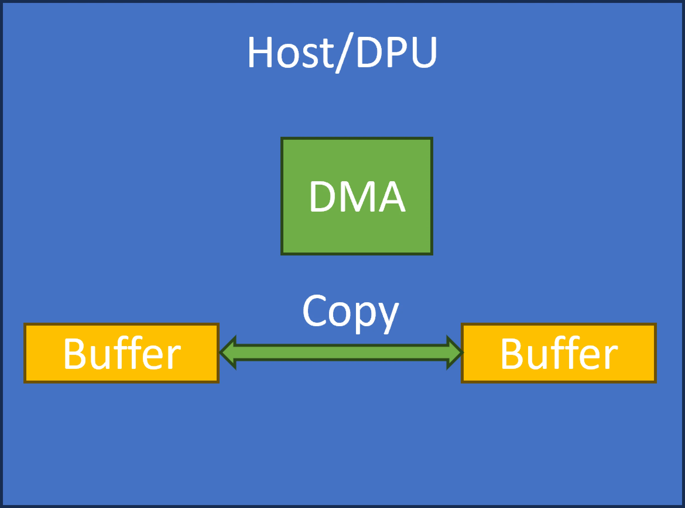
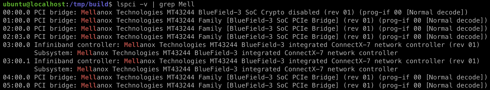
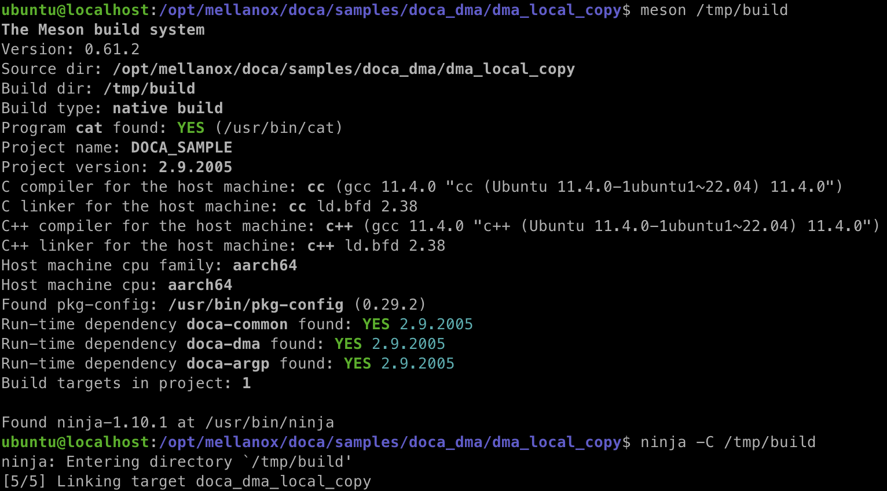
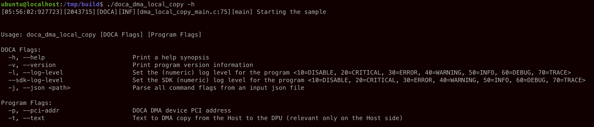
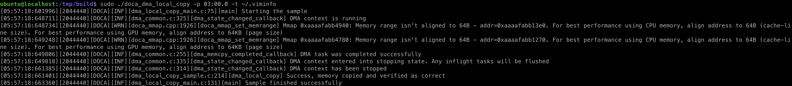
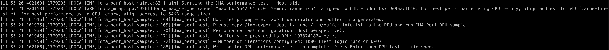
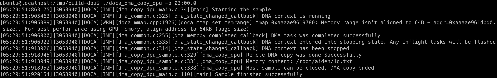

# DOCA DMA Sample

To demonstrate the execution of DOCA sample code, we selected the DMA (Direct Memory Access) example as a representative case. 

In the DMA sample, data is transferred directly between memory regions without involving the CPU, highlighting the low-latency and high-throughput capabilities of the hardware. By running this sample, users can gain hands-on experience with the DOCA programming model, understand the initialization steps, and observe how DMA engines on the DPU can accelerate data transfers.

## Architecture

NVIDIA's DOCA DMA framework enables fast, user-controlled memory copies using the DPU's hardware DMA engines.

* In Local Copy, both source and destination buffers reside on the same device (either DPU or Host). The DMA engine moves data internally without using PCIe, ensuring low latency and minimal overhead. Only a local DOCA device is needed.
* In DPU-Host Copy, the source and destination buffers are on different domains — DPU memory and Host memory. The DMA engine transfers data across the PCIe bus. A representor device abstracts the Host memory to the DPU, allowing the DPU to directly initiate and control the copy.

This architecture separates local and cross-domain operations, optimizing for both intra-device and DPU-to-Host data movement without involving Host CPUs.

## Scenario 1: DMA Local Copy (DPU to DPU)

This sample illustrates how to locally copy memory with DMA from one buffer to another on the DPU. This sample should be run on the DPU.



In this example, we demonstrate data transfer over PCIe, which requires first locating the PCI address of the device. 

The PCI address can be retrieved using tools like `lspci` and must be provided to the application for establishing communication.

```sh
lspci -v | grep Mell
```



Compile the `doca_dma_local_copy` sample:

```
sudo apt install meson
cd /opt/mellanox/doca/samples/doca_dma/dma_local_copy
meson /tmp/build
ninja -C /tmp/build
```

The binary `doca_dma_local_copy` is created under `/tmp/build/`.



If the compilation is successful, the following output will appear when you run the program:

```sh
cd /tmp/build
./doca_dma_local_copy -h
```



We chose to use a network interface card (NIC) for data transfer in this example, in our case the PCI address is `03:00.0` as shown in the command below:

```sh
./doca_dma_local_copy -p 03:00.0
```

If the execution works, the result can be found as follow.



In the DMA example, it is also possible to perform data transfers from the host to the DPU and from the DPU to the host. For a more complete execution guide, please refer to the official documentation.

## Scenario 2: DMA Copy Host/DPU (Host to DPU)

This sample illustrates how to allow memory copy with DMA from the x86 host into the DPU. This sample should be run on the host.

### Host Side

First, we need to run `dma_copy_host` on the Host side. It is important to ensure that the PCIe address specified on the Host corresponds to the PCIe interface derived from the DPU's Physical Function (PF).

The following script (referred to as `iface_pci_state.sh`) can be used to validate the mapping between the PCIe device and its associated NIC.

```sh
echo "Interface Name -> PCI Address -> State"
echo "---------------------------------------"

for iface in /sys/class/net/*; do
  iface_name=$(basename "$iface")
  
  # Only list network interfaces with PCI devices (exclude loopback, docker, bridge etc.)
  if [ -e "$iface/device" ]; then
    pci_addr=$(readlink "$iface/device" 2>/dev/null | sed 's#^.*/##')
    state=$(cat /sys/class/net/"$iface_name"/operstate 2>/dev/null)
    printf "%-15s -> %-10s -> %s\n" "$iface_name" "$pci_addr" "$state"
  fi
done
```

Compile the `dma_copy_host` sample:

```sh
./iface_pci_state.sh
cd /opt/mellanox/doca/samples/doca_dma/dma_copy_host
meson /tmp/build
ninja -C /tmp/build
```

Run the `dma_copy_host` sample. In our case, the PCI address is `01:00.0`:

```sh
cd /tmp/build
sudo ./doca_dma_copy_host -p 01:00.0
```

The code should report error and instruct you to copy `/tmp/export_desc.txt` and `/tmp/buffer_info.txt` to the DPU:

```
[dma_copy_host] Please copy /tmp/export_desc.txt and /tmp/buffer_info.txt to the DPU and run DMA Copy DPU sample
[dma_copy_host] Wait till the DPU has finished and press enter
```

Open another terminal on the host and follow the instructions:

```sh
scp /tmp/export_desc.txt root@<DPU_IP>:/tmp
scp /tmp/buffer_info.txt root@<DPU_IP>:/tmp
```

> Note that this step should be done once per session.

Keep the previous terminal open without pressing Enter. Proceed to the steps in the next section. Once those steps are complete, return to this terminal and press Enter to finalize the operation. The code should then complete successfully with no errors.



### DPU Side

This sample illustrates how to copy memory (which contains user defined text) with DMA from the x86 host into the DPU. This sample should be run on the DPU.

In this example, the DPU initiates a direct memory copy operation targeting the Host's memory space using its DMA engine. The demonstration highlights how the DPU can independently manage data movement without involving the Host CPU, achieving low-latency and high-throughput transfers over PCIe.

Once `/tmp/export_desc.txt` and `/tmp/buffer_info.txt` are placed in the correct path (done in the previous step), you can simply launch `dma_copy_dpu` on the DPU side and specify the `-p` parameter.

Compile the `dma_copy_dpu` sample:

```sh
cd /opt/mellanox/doca/samples/doca_dma/dma_copy_dpu
meson /tmp/build
ninja -C /tmp/build
```

Run the `dma_copy_dpu` sample. In our case, the PCI address is `03:00.0`:

```sh
cd /tmp/build
./doca_dma_copy_dpu -p 03:00.0
```



## References

* [Get Started With NVIDIA DOCA](https://developer.nvidia.com/networking/doca/getting-started#section-set-up-the-software)
* [DOCA DMA](https://docs.nvidia.com/doca/sdk/doca+dma/index.html)
